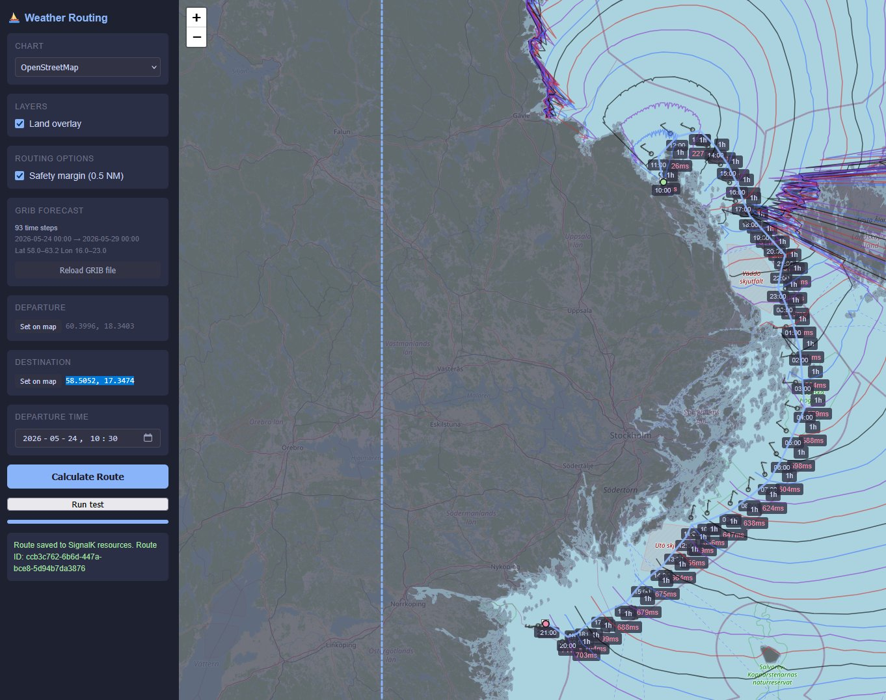

# signalk-weather-routing

> [!CAUTION]
> **Experimental — read before use.**
>
> - Calculated routes have not been validated by sailing them and **may cross land or shallow water**.
> - Weather forecasts change. The route calculated now may not reflect conditions at departure time. Always obtain up-to-date forecasts and check for NOTAMs and local hazards.
> - This plugin **does not replace good seamanship**, a qualified navigator, or certified navigation software. Use is entirely at your own risk.

A SignalK webapp that calculates time-optimal sailing routes using live weather forecasts and the isochrone method.


## Features

- Time-optimal isochrone routing using ECMWF weather forecasts
- Automatic land avoidance using [GSHHG](https://www.soest.hawaii.edu/pwessel/gshhg/) high-resolution coastlines
- Wind, wave height, and ocean current overlays with a time scrubber
- Conditions graph showing wind, wave, and boat speed along the calculated route
- Route weather analysis — per-waypoint forecast along any route
- Routes saved to SignalK `resources/routes` — visible in freeboard-sk
- No server-side setup needed — all computation runs in the browser



## Requirements

- SignalK server >= 2.0.0
- A polar diagram (upload CSV or enter upwind/beam/downwind speeds)
- A modern browser (WebGL required for MapLibre GL JS)

## Installation

Install from the **SignalK App Store** (Server → Appstore → Available) and restart SignalK.

No additional configuration is needed.

## Usage

Open the webapp at `http://<your-signalk-host>:3000/signalk-weather-routing/`.

### Basic workflow

1. **Load a polar** — upload a CSV file or enter upwind/beam/downwind boat speeds to generate one
2. **Set departure** — click "Set on map" and click the map, use vessel position, or select a SignalK route
3. **Set destination** — same options
4. **Set departure time** — defaults to the next half-hour
5. **Calculate Route** — isochrones are drawn live; the finished route shows wind barbs and ETAs

### Route waypoints

Select a route from the **Route waypoints** dropdown to route through its intermediate waypoints in order. The route's first and last waypoints become departure and destination.

### Route weather analysis

Click **Analyse Route Weather** to compute per-waypoint forecasts along any route (set or selected). Shows a table with ETA, wind, wave, TWA, and boat speed at each waypoint, plus markers on the map.

### Routing options

- **Coast avoidance** — enabled by default; uses GSHHG coastlines
- **Safety margin** — dilates coastline by 0.5 NM
- **Motor** — set threshold and motor speed for light-wind legs
- **Wait for wind** — hold position through calm patches
- **Max wind / max wave** — avoid areas exceeding limits

### Map layers

Toggle overlays in the Layers panel:
- **Wind overlay** — wind barbs showing speed and direction
- **Wave height** — colour raster (blue → red)
- **Currents** — cyan arrows showing ocean current
- **Land overlay** — coastline polygons
- **Isochrones** — frontier lines from route calculation
- **Regions** — SignalK avoidance regions

### Time scrubber

Drag the slider to browse forecast times. The wind, wave, and current overlays update to the selected time. After route calculation, the scrubber locks to the route's time range and highlights the corresponding leg.

### Conditions graph

Below the map — shows wind speed, boat speed, and wave height along the calculated route over time. Click to expand fullscreen.

## Polar diagram

### Format

Standard ORC/OpenCPN semicolon-delimited CSV:

```
twa/tws;6;8;10;12;14;16;20
52;4.5;5.2;5.8;6.1;6.3;6.4;6.5
...
```

Or enter three speeds (upwind/beam/downwind at 12 kn TWS) and click "Generate" for a simple polar.

### How the polar is interpreted

The polar diagram tabulates **boat speed through water** as a function of **True Wind Angle (TWA)** and **True Wind Speed (TWS)**:

- **TWA** is the angle between the **wind direction** and the boat's **course through water** — NOT the compass heading. Course through water includes leeway (the sideways slip caused by wind pressure on the sails). VPP-derived polars (ORC, IRC) already account for leeway in their TWA values.
- **TWS** is the wind speed relative to the water, not the ground. When ocean current is present, the algorithm subtracts the current vector from the true wind to obtain the wind-over-water before looking up the polar (see below).
- **Boat speed** is the speed along the course through water. Current is applied separately to compute the ground track.

## Routing physics

The isochrone algorithm models the following physical quantities at each step:

1. **True wind** — forecast wind speed and direction relative to the ground (from ECMWF via Windy tiles), interpolated bilinearly in space and linearly in time.

2. **Ocean current** — forecast current velocity from CMEMS (Copernicus Marine Service) via Windy tiles, when available.

3. **Wind over water** — the wind as experienced by the boat. Computed by subtracting the ocean current vector from the true wind: `wind_over_water = true_wind − current`. This matters because a boat in a current-carrying water mass feels less wind when current flows with the wind, and more when it flows against. The polar diagram is defined relative to this wind-over-water, not the true (ground-referenced) wind.

4. **TWA and boat speed** — for each candidate course through water, compute `TWA = |course_through_water − wind_over_water_direction|` and look up the corresponding boat speed from the polar.

5. **Water track** — the boat moves at polar speed along its course through water.

6. **Ground track** — the water track position plus the current displacement over the time step gives the boat's actual position on the chart.

7. **Land avoidance** — the ground track segment is checked against GSHHG coastline data. Candidates that cross land are rejected.

### What is NOT modelled

- **Leeway** is not computed explicitly. VPP-derived polars already include leeway in their TWA/speed values. Simple polars (hand-measured or generated) implicitly assume course = heading.
- **Apparent wind effects** — the polar is indexed by true wind (over water), not apparent wind. This is standard for routing software.
- **Sea state effects on boat speed** — wave height can be used as a routing constraint (max wave limit) but does not reduce the polar speed.

## Land data

Land avoidance uses [GSHHG](https://www.soest.hawaii.edu/pwessel/gshhg/) v2.3.7 (GNU LGPL v3). Pre-built binary indices are bundled — no download needed.

High-resolution coastlines (~100 m) are available from [weather-routing-hires-land-data](https://github.com/kristianwiklund/weather-routing-hires-land-data).

## Development

See [DEVELOPMENT.md](DEVELOPMENT.md).
